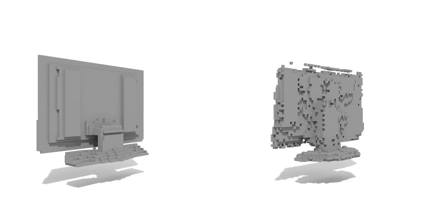

# GAN 3D Object Synthesis

## Datasets
[http://vision.princeton.edu/projects/2014/3DShapeNets/ModelNet10.zip][1]

## Result
### Nearest Neighbor
<table>
  <tr>
    <td></td>
    <td></td>
  </tr>
  <tr>
    <td>Bed</td>
    <td>Chair</td>
  </tr>
  <tr>
    <td></td>
    <td></td>
  </tr>
  <tr>
    <td>Monitor</td>
    <td>Sofa</td>
  </tr>
</table>
### Linear Interpolation
<table>
  <tr>
    <td></td>
    <td></td>
    <td></td>
    <td></td>
  </tr>
  <tr>
    <td>Bed</td>
    <td>Chair</td>
    <td>Monitor</td>
    <td>Sofa</td>
  </tr>
</table>

[1]:	http://vision.princeton.edu/projects/2014/3DShapeNets/ModelNet10.zip